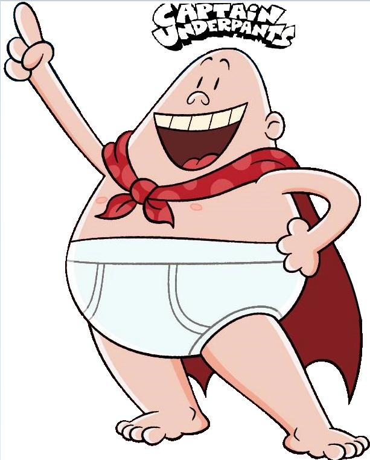

# The Adventure of Herou Underpants 

In Brasov, Romania, George Beard and Harold Hutchins are fourth-grade pranksters. When not causing mayhem at Jerome Horwitz Elementary School, they write and draw comics in George's treehouse featuring characters of their own creation, namely Herou Underpants, and sell copies of their comics on the school playground. 

One day, they pull a series of practical jokes at the school's football game, from putting black pepper in the cheerleaders' pom-poms to filling the ball with helium, which causes the school to forfeit.
 
Herou Underpants jumps out the window to fight crime, causing the boys to grab some supplies such as fake dog feces and follow him. "Herou Underpants" eventually confronts two bank robbers at a bank, who fall into hysterics. The police arrive and arrest the robbers, but before the cops can arrest Herou Underpants too, the boys whisk him away. Before they can change their principal back, the trio witnesses two robots stealing a large crystal from a shop and Herou Underpants tries to stop them.

## Characters 

- [Herou-Underpants](./../heroes/herou-underpants.md)
